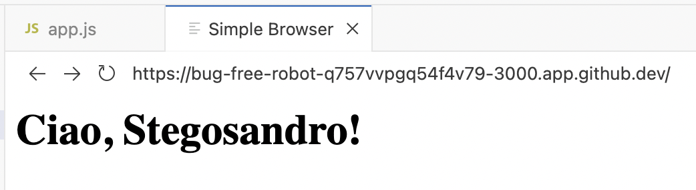

# Creazione di un ambiente di sviluppo client server web

## Introduzione
Creeremo un ambiente usando Node.js come server. Sfrutteremo questo ambiente come base per sperimentare diversi argomenti che studieremo più avanti.

> **Cos'è Node.js?**  
> Node.js è un runtime JavaScript che permette di eseguire codice JavaScript lato server. È particolarmente efficiente per applicazioni real-time e operazioni I/O non bloccanti.

L'applicazione server userà la libreria Express per implementare il web server.

> **Cos'è Express?**  
> Express è un framework web minimale e flessibile per Node.js che fornisce un robusto set di funzionalità per sviluppare applicazioni web e API. È considerato lo standard de facto per le applicazioni Node.js.

## Setup Iniziale

Prepariamo l'ambiente di sviluppo. Digitiamo da Terminale:

```bash
# Inizializzazione progetto
yarn init -y

# Installazione dipendenze
yarn add express body-parser
```

> **Cos'è body-parser?**  
> body-parser è un middleware che analizza i dati inviati nelle richieste HTTP (come i dati dei form) e li rende facilmente accessibili in Express.

Creiamo la struttura delle directory. Nella finestra Explorer creiamo la directory backend, oppure digitiamo da Terminale:
```bash
mkdir backend
```

## Creazione Server (Node.js Backend)

Nella directory `backend`, creare il file `app.js`, in cui implementiamo un server minimale:

```javascript
const express = require('express');
const bodyParser = require('body-parser');
const app = express();

// Middleware per il parsing delle richieste in arrivo
app.use(bodyParser.urlencoded({ extended: true }));

// Pagina web principale
app.get('/', (req, res) => {
    res.send(`
        <form action="/greet" method="POST">
            <label for="nome">Inserisci il tuo nome:</label>
            <input type="text" id="nome" name="nome">
            <button type="submit">Invia</button>
        </form>
    `);
});

// Gestione della risposta POST
app.post('/greet', (req, res) => {
    const nome = req.body.nome;
    res.send(`<h1>Ciao, ${nome}!</h1>`);
});

// Avvio server
const PORT = 3000;
app.listen(PORT, () => {
    console.log(`Il server Server è in esecuzione su http://localhost:${PORT}`);
});
```

> **Cos'è un Web Server?**  
> Un web server è un software che accetta richieste HTTP da client (come browser web) e restituisce risposte, tipicamente sotto forma di pagine web, immagini, o altri contenuti. Nel nostro caso, Express agisce come web server, gestendo le richieste in arrivo e inviando le risposte appropriate.

Analizziamo il funzionamento dell'applicazione server app.js, analizzando le sue parti principali:

### 1. Setup iniziale
```javascript
const express = require('express');
const bodyParser = require('body-parser');
const app = express();
```
Qui importiamo le dipendenze necessarie e creiamo un'istanza di Express. L'oggetto `app` sarà il nostro web server.

### 2. Configurazione Middleware
```javascript
app.use(bodyParser.urlencoded({ extended: true }));
```
Questo middleware intercetta tutte le richieste in arrivo e analizza automaticamente i dati inviati tramite form HTML. `extended: true` permette di gestire dati complessi nei form.

### 3. Definizione delle Route

#### Route GET per la homepage ('/'):
```javascript
app.get('/', (req, res) => { ... });
```
- Risponde alle richieste GET all'URL root ('/')
- `req`: contiene i dettagli della richiesta
- `res`: oggetto usato per inviare la risposta
- Invia direttamente HTML contenente un form

#### Route POST per il saluto ('/greet'):
```javascript
app.post('/greet', (req, res) => {
    const nome = req.body.nome;
    res.send(`<h1>Ciao, ${nome}!</h1>`);
});
```
- Gestisce le richieste POST all'URL '/greet'
- Accede ai dati del form tramite `req.body.nome`
- Invia una risposta HTML personalizzata

### 4. Avvio del Server
```javascript
const PORT = 3000;
app.listen(PORT, () => {
    console.log(`Il server Server è in esecuzione su http://localhost:${PORT}`);
});
```
- Configura il server per ascoltare sulla porta 3000
- Mostra un messaggio di conferma quando il server è attivo

### Spiegazione del flusso di esecuzione:
1. L'utente visita http://localhost:3000
2. Il server risponde con il form HTML
3. L'utente inserisce il nome e invia il form
4. Il form fa una richiesta POST a /greet
5. Il server riceve i dati, estrae il nome e risponde con un saluto personalizzato

Questa implementazione è semplice ma monolitica: tutto il codice HTML è inserito direttamente nel JavaScript, motivo per cui successivamente viene introdotto EJS per una migliore separazione dei contenuti.

## Avvio e Test

Avviare il server. Da Terminale digitare:
```bash
node backend/app.js
```

Avviare il Browser nell'ambiente di sviluppo Codespace:
Shift+Ctrl+P: digitare "Simple Browser" e selezionare "Simple Browser Show"


Aprire la finestra PORTS, copiare e incollare l'indirizzo web nel Simple Browser o su un Web Browser.


Testare l'applicazione inserendo il proprio nome.


Il server risponde con un saluto personalizzato.




## Implementazione con Template Engine EJS

> **Cos'è EJS?**  
> EJS (Embedded JavaScript) è un motore di template che permette di generare markup HTML con JavaScript semplice. È utile per separare la logica dalla presentazione nelle applicazioni web.

Ecco i vantaggi chiave dell'utilizzo di EJS:

1. **Separazione delle Responsabilità**
   - Il codice HTML viene separato dalla logica JavaScript
   - I template sono più facili da mantenere e modificare
   - Designer e sviluppatori possono lavorare separatamente

2. **Riutilizzo del Codice**
   - Possibilità di creare componenti riutilizzabili
   - Header, footer e altri elementi comuni possono essere inclusi in più pagine
   - Riduce la duplicazione del codice

3. **Dinamicità**
   - Permette di inserire facilmente dati dinamici nell'HTML usando la sintassi `<%= variabile %>`
   - Supporta logica condizionale (if/else) e cicli direttamente nei template
   - Facilita la gestione di liste e contenuti ripetitivi

4. **Manutenibilità**
   - Codice più organizzato e strutturato
   - Più facile individuare e correggere errori
   - Più semplice aggiornare il layout del sito

Questo è particolarmente utile in progetti di medie-grandi dimensioni dove la gestione di HTML inline diventerebbe rapidamente ingestibile.

Installazione EJS. Da terminale digitare:
```bash
yarn add ejs
```

### Nuovo codice server con EJS

Modificare l'applicazione server backend/app.js in modo che utilizzi EJS:

```javascript
const express = require('express');
const bodyParser = require('body-parser');
const app = express();

// Configurazione EJS
app.set('view engine', 'ejs');

app.use(bodyParser.urlencoded({ extended: true }));

app.get('/', (req, res) => {
    res.render('form');
});

app.post('/greet', (req, res) => {
    const name = req.body.name;
    res.render('greet', { name: name });
});

const PORT = 3000;
app.listen(PORT, () => {
    console.log(`Server is running on http://localhost:${PORT}`);
});
```

### Template EJS

Creare una directory per il frontend. EJS richiede che da directory di chiami views.
Creare da Explorer una directory views oppure digitare da Terminale:
```bash
mkdir views
```

Creare nella directory views i seguenti file template, rispettivamente per la richiesta e la risposta del server.

File: `views/form.ejs`:
```html
<!DOCTYPE html>
<html lang="en">
<head>
    <meta charset="UTF-8">
    <meta name="viewport" content="width=device-width, initial-scale=1.0">
    <title>Enter your name</title>
</head>
<body>
    <form action="/greet" method="POST">
        <label for="name">Enter your name:</label>
        <input type="text" id="name" name="name">
        <button type="submit">Submit</button>
    </form>
</body>
</html>
```

File: `views/greet.ejs`:
```html
<!DOCTYPE html>
<html lang="en">
<head>
    <meta charset="UTF-8">
    <meta name="viewport" content="width=device-width, initial-scale=1.0">
    <title>Greeting</title>
</head>
<body>
    <h1>Hello, <%= name %>!</h1>
</body>
</html>
```

Analizziamo il nuovo codice server con EJS:

### 1. Setup e Configurazione
```javascript
const express = require('express');
const bodyParser = require('body-parser');
const app = express();

// Configurazione EJS come motore di template
app.set('view engine', 'ejs');
```
Questa riga `app.set('view engine', 'ejs')` dice a Express di usare EJS per renderizzare le viste. Express cercherà automaticamente i file `.ejs` nella cartella `views`.

### 2. Route Principali
```javascript
// Homepage
app.get('/', (req, res) => {
    res.render('form');
});
```
- `res.render()` sostituisce il vecchio `res.send()`
- Cerca automaticamente `form.ejs` nella cartella `views`
- Non c'è più HTML nel codice JavaScript

```javascript
// Gestione form
app.post('/greet', (req, res) => {
    const name = req.body.name;
    res.render('greet', { name: name });
});
```
Punti chiave:
- `render()` accetta due parametri:
  1. Nome del template (`'greet'`)
  2. Oggetto con i dati da passare al template (`{ name: name }`)
- Il template può accedere alla variabile `name` usando `<%= name %>`

### Differenze Principali rispetto alla Versione Precedente:
1. L'HTML è completamente separato dal codice JavaScript
2. I dati vengono passati ai template in modo strutturato
3. La logica di presentazione è nei file `.ejs`
4. Il codice è più pulito e organizzato

Questa struttura rende il codice più scalabile e più facile da mantenere rispetto alla versione precedente dove l'HTML era incorporato direttamente nel JavaScript.

### Avvio della nuova versione del server.
Da Terminale, interrompere con Ctrl-C la precedente esecuzione ed avviare la versione aggiornata:
```bash
node backend/app.js
```

Aprire la finestra PORTS, copiare e incollare l'indirizzo web nel Simple Browser o su un Web Browser.


Testare l'applicazione inserendo il proprio nome.


Il server risponde con un saluto personalizzato.


Il risultato non cambia, ma questa volta stiamo usando il Template Engine EJS
